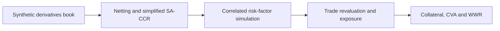

# Counterparty Credit Risk Simulation

## Simplified SA-CCR, Monte Carlo Exposure, Collateral, CVA and Wrong-Way Risk

An end-to-end counterparty credit risk (CCR) project for a fully synthetic derivatives portfolio. The analysis connects a portfolio-wide regulatory-style exposure measure with a focused Monte Carlo deep dive on one representative netting set.

The project covers trade netting, simplified SA-CCR, correlated market-factor simulation, trade revaluation, exposure profiles, CSA collateral mechanics, credit valuation adjustment (CVA), and wrong-way risk (WWR).

> **Project status:** Complete  
> **Author:** Diheng (Hector) Xin  
> **As-of date:** August 2026  
> **Valuation date:** June 15, 2025  
> **Units:** U.S. dollars

[Read the full project report](./CCR_Project_Report.pdf) | [View the Python model](./CCR-Project.py) | [View the synthetic portfolio](./CCR_Book_Simulation_v3.xlsx)

---

## Project Objective

The objective is to demonstrate how counterparty exposure can be measured from both regulatory and economic perspectives:

1. Measure current exposure and netting benefits across the full derivatives book.
2. Estimate replacement cost, potential future exposure and EAD using a simplified SA-CCR framework.
3. Simulate correlated market risk factors and revalue trades through time.
4. Calculate EE, EPE and PFE at the netting-set level.
5. Model variation margin using threshold, MTA and MPOR assumptions.
6. Estimate collateralized CVA and credit-spread sensitivity.
7. Isolate the effect of pathwise exposure-credit dependence on WWR.

Parts 1-2 cover the full portfolio. Parts 3-6 focus on `CSA-005` to keep the detailed simulation transparent and computationally manageable.

---

## Modeling Framework



### 1. Portfolio Review and Netting

Trades are grouped by counterparty and netting agreement under an assumed legally enforceable master agreement. Positive and negative mark-to-market values offset within each netting set before replacement cost is floored at zero.

`RC = max(Net MTM, 0)`

### 2. Simplified SA-CCR

The full-book calculation applies supervisory delta, supervisory duration, maturity factors, hedging-set aggregation and the PFE multiplier:

`EAD = 1.4 x (RC + PFE)`

The implementation is intentionally labeled **simplified SA-CCR** because rate maturity-bucket correlations, collateralized replacement cost and Basel-prescribed option volatilities are not fully implemented.

### 3. Monte Carlo Exposure Simulation

The detailed model simulates 5,000 correlated monthly paths over 8.35 years for `CSA-005`:

| Risk factor | Process |
|---|---|
| Equity and FX | Geometric Brownian motion |
| Rates, commodity and credit | Mean reversion in log space |
| Cross-factor dependence | Cholesky-correlated shocks |

Eight live trades are revalued with product-sensitive approximations. Forward-style valuation is used for equity, FX and commodity positions; annuity-scaled valuation is used for rates and CDS; and the swaption receives a calibrated Black-76-style treatment. Trades roll off at their contractual maturities.

The simulation produces:

- **EE:** average positive exposure at each future date.
- **EPE:** time-average of the EE profile.
- **PFE:** high-percentile exposure at each future date.

### 4. Collateral and CSA Mechanics

Variation margin is modeled using:

- Threshold: **$500,000**
- Minimum transfer amount: **$250,000**
- Margin period of risk: **10 business days**

Held collateral changes only when the required transfer reaches the MTA. The MPOR lookback creates residual exposure between the latest collateral amount and the current exposure.

### 5. Credit Valuation Adjustment

CVA is calculated from the collateralized EE profile using discounted marginal default losses:

`CVA = LGD x sum(Discount Factor x EE x Marginal PD)`

The model uses the median credit spread of live `CSA-005` trades as a synthetic counterparty proxy, a 60% LGD, an exponential survival model and a flat 4% risk-free discount rate. A spread sensitivity range is also reported.

### 6. Wrong-Way Risk

The counterparty spread proxy is linked to the simulated `ITRAXX.EU` path. Two CVA estimates are compared:

- **Independent benchmark:** preserves the same stochastic spread distribution but separates it from exposure.
- **Joint path-linked CVA:** preserves the path-by-path relationship between exposure and credit deterioration.

This design isolates dependence-driven WWR instead of mixing it with the standalone effect of credit-spread volatility.

---

## Portfolio and Key Results

| Metric | Result |
|---|---:|
| Portfolio size | 120 trades |
| Netting sets / counterparties | 8 / 6 |
| Asset classes | 5 |
| Full-book gross exposure | $117.5M |
| Full-book replacement cost | $85.0M |
| Portfolio netting benefit | 27.7% |
| Full-book simplified SA-CCR EAD | $478.5M |
| `CSA-005` simplified SA-CCR EAD | $82.1M |
| `CSA-005` uncollateralized lifetime EPE | $9.77M |
| `CSA-005` collateralized lifetime EPE | $0.79M |
| EPE reduction from collateral | 91.9% |
| Uncollateralized CVA, contextual | $1.77M |
| Collateralized CVA | $142,759 |
| Collateralized CVA sensitivity range | $47,551-$184,333 |
| Independent / joint WWR CVA | $145,335 / $146,252 |
| Within-model WWR add-on | $916 / 0.6% |

---

## Main Findings

### Regulatory and Economic Exposure

- **The two frameworks answer different questions.** `CSA-005` produces $82.1M of simplified SA-CCR EAD, while the simulated lifetime EPE is $9.77M before collateral. The difference is informative but is not a direct model-validation comparison: SA-CCR EAD is a conservative regulatory exposure measure, while EPE is an average simulated exposure profile.
- **Netting benefits vary materially by agreement.** The full book achieves a 27.7% reduction from gross positive MTM to replacement cost, but `CSA-005` receives only a 0.5% benefit because its net MTM remains strongly positive.

### Collateral and Tail Risk

- **Collateral strongly reduces average exposure.** Modeled variation margin lowers EPE by 91.9%, from $9.77M to approximately $0.79M.
- **Collateral does not eliminate tail exposure.** PFE remains above the contractual threshold because the MTA and 10-day MPOR create residual exposure gaps.
- **CVA remains economically relevant after collateral.** The collateralized estimate is $142,759, with a range of $47,551-$184,333 under the observed spread sensitivity assumptions.

### Wrong-Way Risk

- **The modeled WWR signal is positive but modest.** Joint path-linked CVA exceeds the independent benchmark by $916, or 0.6%.
- **Exposure rises with the credit proxy.** Average lifetime EPE increases across low-, middle- and high-spread path groups.
- **Dependence must be isolated carefully.** Comparing joint and independent CVA under the same stochastic spread distribution prevents ordinary spread volatility from being misclassified as WWR.

---

## Model Interpretation and Sanity Checks

The final analysis includes several internal consistency checks:

1. Gross exposure, net MTM and replacement cost reconcile by netting set.
2. Replacement cost is floored at zero when the net MTM is negative.
3. Exposure declines in stages as major trades mature and roll off.
4. Collateralized exposure remains non-negative and below uncollateralized exposure.
5. CVA decreases materially after collateral, consistent with the lower EE profile.
6. WWR is measured against an independence benchmark with the same spread distribution.

These checks support model sanity, but they do not constitute independent validation or regulatory approval.

---

## Repository Structure

```text
.
|-- CCR-Project.py                    # End-to-end Python model
|-- CCR_Book_Simulation_v3.xlsx       # Synthetic derivatives portfolio
|-- CCR_Project_Report.pdf            # Final analytical report
|-- README.md
`-- output/                           # Generated arrays, summaries and charts
```

---

## Running the Model

### Requirements

- Python 3.10+
- pandas
- NumPy
- SciPy
- Matplotlib
- openpyxl

Install the required packages:

```bash
pip install pandas numpy scipy matplotlib openpyxl
```

Keep the Python script and Excel workbook in the same folder, then run:

```bash
python CCR-Project.py
```

The script saves intermediate simulation arrays and summary files that support the later collateral, CVA and WWR steps.

---

## Limitations and Potential Extensions

This is an educational and recruiting project rather than a production pricing or regulatory-capital platform. Important limitations include:

- All trades, counterparties, CSA terms and results are synthetic.
- The full-book regulatory calculation is a simplified SA-CCR approximation.
- The detailed simulation covers one netting set rather than the full portfolio.
- Market dynamics, volatilities and correlations are scenario assumptions rather than calibrated market inputs.
- Product-sensitive approximations replace full pricing curves, cash-flow schedules and production valuation models.
- Hazard rates and discount rates are flat because the synthetic dataset does not contain market curves.
- The WWR process uses a broad credit index rather than a calibrated single-name credit model.
- Collateral modeling excludes initial margin, haircuts, collateral interest and dispute periods.

Potential extensions include full Basel SA-CCR treatment, market-calibrated curves and volatilities, daily simulation, initial margin, multi-netting-set exposure, dynamic collateral disputes, single-name credit calibration and XVA aggregation.

---

## What This Project Demonstrates

- Derivatives portfolio review and netting-set aggregation.
- Simplified SA-CCR exposure methodology.
- Correlated multi-asset Monte Carlo simulation.
- EE, EPE and PFE exposure analytics.
- CSA collateral, MTA and MPOR mechanics.
- CVA estimation and sensitivity analysis.
- Pathwise wrong-way-risk measurement.
- Python modeling, validation, visualization and model-risk communication.

---

## Methodology References

- Basel Committee on Banking Supervision, [CRE52 - Standardised approach to counterparty credit risk](https://www.bis.org/basel_framework/chapter/CRE/52.htm)
- Basel Committee on Banking Supervision, [MAR50 - Credit valuation adjustment framework](https://www.bis.org/basel_framework/chapter/MAR/50.htm)
- Standard market relationships used in the project include the credit-triangle approximation, exponential survival probabilities, discounted expected-loss CVA and Monte Carlo exposure simulation.

---

## Disclaimer

All counterparties, trades, exposures, CSA terms, agreement identifiers and results are fictional and anonymized. Any resemblance to an actual institution or portfolio is coincidental. This project is for educational and portfolio-demonstration purposes only and is not an official regulatory capital calculation, production valuation system or investment recommendation.
