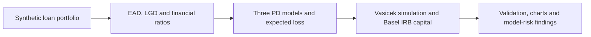

# High-Yield Corporate Loan Portfolio

## PD Model Benchmarking and Basel IRB Capital

An end-to-end wholesale credit risk project covering borrower-level probability of default (PD), exposure at default (EAD), loss given default (LGD), expected loss, portfolio loss simulation, concentration risk, and Basel Internal Ratings-Based (IRB) capital.

The analysis is built in Python on a fully synthetic portfolio of 20 high-yield corporate loans. It combines financial-statement analysis, structural credit modeling, market-implied risk signals, Monte Carlo simulation, and regulatory capital methodology in one reproducible workflow.

> **Project status:** Complete  
> **Author:** Diheng (Hector) Xin  
> **As-of date:** August 18, 2026  
> **Units:** USD millions (`$mm`)

[Read the full project report](./HY_Portfolio_IRB_Report.pdf) | [View the Python model](./HY_Portfolio_PD_Model_%20Basel_IRB_Capital.py)

---

## Project Objective

The purpose of this project is to demonstrate how a wholesale credit portfolio can be analyzed from individual borrower fundamentals through portfolio-level capital:

1. Estimate EAD from drawn balances, undrawn commitments, and facility-level credit conversion factors.
2. Estimate through-the-cycle and downturn LGD using claim seniority and stressed recovery assumptions.
3. Develop and compare three independent one-year PD signals.
4. Calculate expected loss under multiple PD scenarios.
5. Simulate correlated defaults and portfolio credit losses under a Vasicek one-factor framework.
6. Calculate Basel corporate IRB capital and risk-weighted assets.
7. Validate the model and identify concentration, calibration, and model-risk limitations.

The project is designed as a transparent academic model rather than a production bank IRB system. Assumptions are deliberately visible so that the methodology can be challenged and sensitivity-tested.

---

## Modeling Framework



### 1. Exposure at Default

Facility EAD is calculated as:

`EAD = Drawn Amount + CCF x Undrawn Commitment`

EAD is floored at the drawn balance and benchmarked against a 75% supervisory CCF scenario. Because the portfolio is highly utilized, most exposure comes from funded term loans rather than undrawn commitments.

### 2. Loss Given Default

Through-the-cycle LGD is assigned using an illustrative seniority-based recovery framework. A separate downturn LGD is produced by applying haircuts to recovery rates:

`Downturn Recovery = TTC Recovery x (1 - Recovery Haircut)`

TTC LGD is used for expected loss, while downturn LGD is used in the Vasicek simulation and IRB capital calculation. Collateral coverage is retained as a diagnostic rather than used directly in the base LGD estimate.

### 3. Probability of Default

Three PD methodologies provide independent views of borrower credit quality:

| Model | Primary information | Role in the framework |
|---|---|---|
| Fundamental scorecard | Leverage, coverage, cash flow, profitability, liquidity and growth | Base PD used for EL, simulation and capital |
| Merton structural model | Equity value, equity volatility and debt structure | Forward-looking challenger and ordinal risk signal |
| Spread-implied PD | Market credit spread and LGD | Market-based challenger in risk-neutral and adjusted real-world form |

The scorecard converts eight financial ratios into weighted sub-scores, a financial score, a shadow rating, and a one-year PD. The Merton model solves simultaneously for unobservable asset value and asset volatility before calculating distance to default. The spread model uses the credit-triangle relationship and exponential survival to infer default intensity.

### 4. Expected Loss

Expected loss is calculated as:

`EL = PD x LGD(TTC) x EAD`

EL is calculated under the scorecard, Merton, raw spread-implied, and premium-adjusted spread PD scenarios. This provides a direct measure of model sensitivity to the choice of PD methodology.

### 5. Vasicek Portfolio Simulation

The simulation uses a one-factor Gaussian copula in which each borrower's latent asset return contains:

- A shared systematic factor representing the economic environment.
- An idiosyncratic borrower-specific shock.
- A Basel PD-dependent asset correlation.

The model runs 500,000 seeded scenarios and aggregates borrower defaults using EAD and downturn LGD. Outputs include expected loss, standard deviation, 99.0% and 99.9% VaR, expected shortfall, unexpected loss, and default-count statistics.

### 6. Basel IRB Capital

Borrower-level IRB capital is calculated using the Basel corporate risk-weight function, including:

- One-year PD and the corporate PD floor.
- Downturn LGD.
- Basel asset correlation.
- The 99.9% conditional default probability.
- Effective maturity bounded between one and five years.
- The Basel maturity adjustment.

Risk-weighted assets are calculated as `RWA = K x 12.5 x EAD`.

---

## Portfolio and Key Results

| Metric | Result |
|---|---:|
| Borrowers / loans | 20 |
| Total commitments | \$18,466.8mm |
| Total EAD | \$17,719.3mm |
| EAD-weighted base PD | 1.06% |
| EAD-weighted LGD - TTC / downturn | 37.85% / 53.21% |
| Base expected loss | \$78.1mm / 44 bp of EAD |
| Total RWA | \$20,677.8mm |
| Average risk weight | 116.7% |
| IRB capital | \$1,654.2mm / 9.34% of EAD |
| Simulated VaR at 99.9% | \$2,545.5mm |
| Simulated unexpected loss at 99.9% | \$2,439.5mm |
| Expected shortfall at 99.9% | \$2,953.5mm |
| Top-five EAD concentration | 62.8% |
| EAD Herfindahl index | 0.0944 |
| Effective number of exposures | 10.6 |

The simulated 99.9% unexpected loss exceeds maturity-adjusted IRB capital by approximately \$785.3mm, or 47.5%. This comparison is an indicator of material finite-name concentration risk, although it is not a pure like-for-like granularity reconciliation because the regulatory IRB amount includes maturity adjustment.


---

## Main Findings

### Credit Risk

- **Single-name concentration dominates the tail.** Although the portfolio contains 20 borrowers, its EAD concentration is equivalent to approximately 10.6 equally sized exposures.
- **Losses are infrequent but highly uneven.** Approximately two-thirds of simulated one-year scenarios contain no defaults, while the 99.9% tail is driven by clustered defaults among large borrowers.
- **Downturn recovery assumptions matter.** EAD-weighted LGD rises from 37.85% on a TTC basis to 53.21% under the downturn recovery stress.
- **Maturity redistributes capital.** Borrowers with similar PD and LGD can produce materially different capital charges because of effective maturity.

### PD Model Risk

- The EAD-weighted Merton PD is below the base scorecard estimate, while the spread-implied estimates are higher; the challenger models therefore bracket the base PD.
- Half of the theoretical Merton estimates reach the 0.05% PD floor, illustrating the limitations of Gaussian structural default models for healthier issuers.
- Raw spread-implied PDs include default-risk, liquidity, and risk-premium compensation and should not be interpreted directly as physical default frequencies.
- The fundamentals-only scorecard generally produces slightly stronger shadow ratings than external ratings, supporting the case for qualitative sector and business-risk overlays.

---

## Validation

The model contains six independent checks:

1. EAD reconciles exactly to drawn exposure plus converted undrawn exposure.
2. Simulated expected loss converges to analytical `PD x LGD x EAD`.
3. Simulated marginal default frequencies reproduce the input PDs.
4. IRB capital is recomputed independently for the largest exposure.
5. The capital rate is monotonic in PD across a 500-point test grid.
6. The 99.9% Monte Carlo tail is tested across multiple random seeds.

All six validation checks pass in the final run.

---

## Repository Structure

```text
.
|-- HY_Portfolio_PD_Model_ Basel_IRB_Capital.py   # End-to-end Python model
|-- synthetic_corporate_loan_portfolio.xlsx       # Synthetic input portfolio
|-- HY_Portfolio_IRB_Report.pdf                    # Final analytical report
|-- README.md
`-- output/                                        # Generated results and charts
    |-- portfolio_final.csv
    |-- simulation_summary.csv
    |-- 01_loss_distribution.png
    |-- 02_pd_model_comparison.png
    |-- 03_capital_vs_exposure.png
    |-- 04_risk_weight_curve.png
    `-- 05_concentration.png
```

---

## Running the Model

### Requirements

- Python 3.10+
- NumPy
- pandas
- SciPy
- Matplotlib
- openpyxl

Install the required packages:

```bash
pip install numpy pandas scipy matplotlib openpyxl
```

### Input path

The `DATA_FILE` variable near the beginning of the script points to the Excel input workbook. Update it to the workbook's location on your computer before running the model.

```python
DATA_FILE = Path(r"C:\path\to\synthetic_corporate_loan_portfolio.xlsx").resolve()
```

The workbook must contain a sheet named `Master_Portfolio` with the variables used by the model.

### Execute

```bash
python "HY_Portfolio_PD_Model_ Basel_IRB_Capital.py"
```

The script creates the `output` directory and exports borrower-level results, a simulation summary, and five charts.

---

## Limitations and Potential Extensions

This project is intentionally transparent about its limitations:

- The portfolio and borrower financials are synthetic.
- Scorecard weights, anchors, rating PDs, LGD tables, recovery haircuts, and risk-premium adjustments are illustrative expert inputs rather than institutionally calibrated parameters.
- The base scorecard excludes qualitative sector, management, covenant, and business-risk assessments.
- LGD is driven primarily by seniority and does not implement a full collateral waterfall or workout-cost model.
- Merton PDs use the theoretical structural mapping rather than an empirically calibrated expected-default-frequency model.
- Spread-implied PD relies on a simplified credit-triangle relationship.
- The simulation uses a single systematic Gaussian factor and Basel asset correlations.
- The standard corporate correlation function is used without an SME firm-size adjustment.
- The portfolio is small and concentrated, so high-confidence empirical quantiles are discrete and exposure-sensitive.

Potential extensions include sector overlays, collateral-sensitive LGD, SME correlation treatment, macroeconomic stress scenarios, empirical PD calibration, multi-factor dependence, and a formal Pillar 2 granularity adjustment.

---

## What This Project Demonstrates

- End-to-end wholesale credit portfolio construction.
- Borrower financial analysis and shadow-rating development.
- Structural and market-implied PD benchmarking.
- Basel IRB capital and RWA calculations.
- Correlated default and portfolio loss simulation.
- Concentration measurement and capital attribution.
- Reproducible Python modeling, validation, visualization, and model-risk communication.

---

## Methodology References

- Basel Committee on Banking Supervision, [CRE31 - IRB approach: risk-weight functions](https://www.bis.org/basel_framework/chapter/CRE/31.htm)
- Basel Committee on Banking Supervision, [CRE32 - IRB approach: risk components](https://www.bis.org/basel_framework/chapter/CRE/32.htm)
- Basel Committee on Banking Supervision, [CRE36 - Minimum requirements to use the IRB approach](https://www.bis.org/basel_framework/chapter/CRE/36.htm)
- Merton, R. C. (1974), [On the Pricing of Corporate Debt: The Risk Structure of Interest Rates](https://doi.org/10.1111/j.1540-6261.1974.tb03058.x)
- Corporate default, transition, and recovery research published by major credit-rating agencies.

---

## Disclaimer

This project is for academic and portfolio-demonstration purposes only. It is not investment advice, a production credit decisioning system, or a regulatory capital model approved for bank use.

